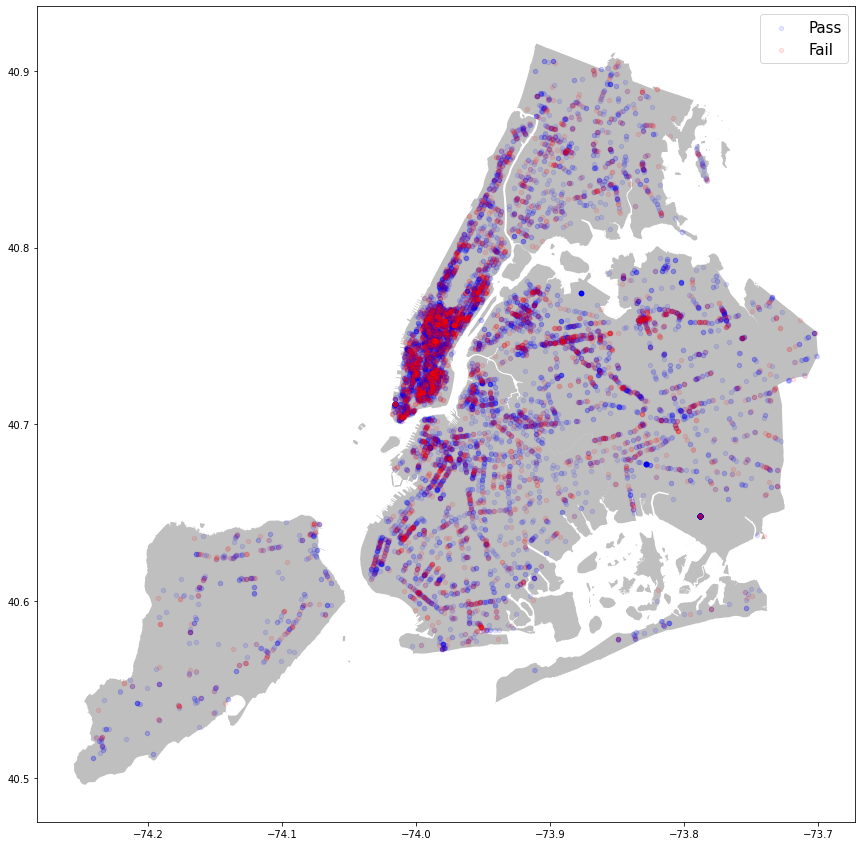
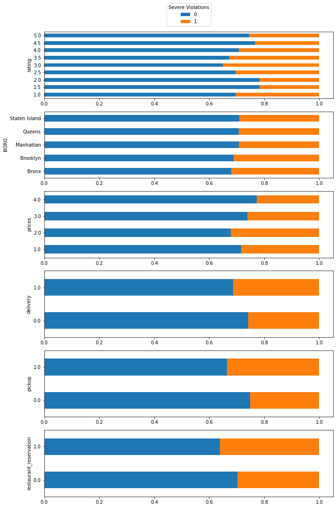
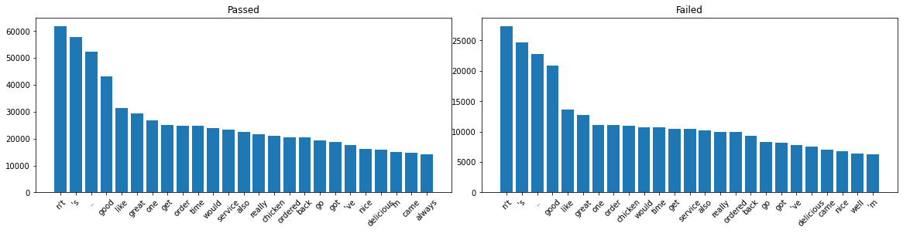
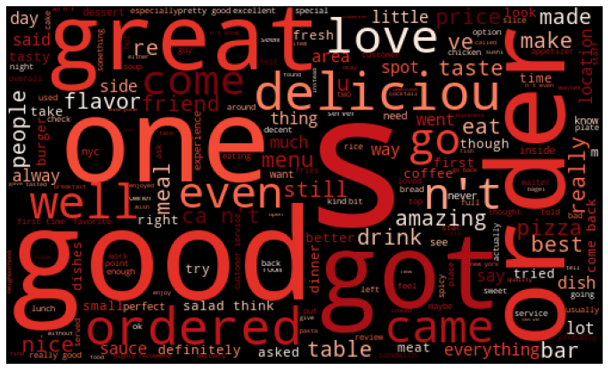
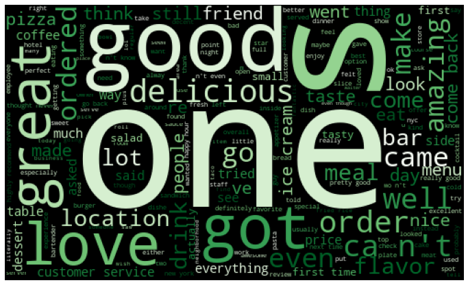

# Predicting NYC Health Violations

Using Yelp reviews and the city's open data of past violations to flag public health risks at NYC restaurants.


## Introduction

Cities across the United States are capitalizing on data. Predictive modeling is becoming a prominent tool for public safety in many cities where the local authority can target interventions. These preventative measures range from predicting which landlords are not complying with city ordinances to which buildings pose the highest risk of fire so they can send inspectors out and prevent an outbreak before it happens.

According to the CDC, more than 48 million Americans per year become sick from food, and an estimated 75% of the outbreaks came from food prepared by caterers, delis, and restaurants. In most cities, health inspections are generally random, which can increase time spent on spot checks at clean restaurants that have been following the rules closely — and missed opportunities to improve health and hygiene at places with more pressing food safety issues.

### Objective

The goal for this project is to leverage public citizen generated data from social media to narrow the search for critical health and safety violations in New York City. As the City of New York manages an open data portal, everyone can access historical hygiene inspections and violation records. By combine these two data source this project aims to determine which words, phrases, ratings, and patterns among restaurants lead to critical health and safety violations. This model can assist city health inspectors do their job better by prioritizing the kitchens most likely to be in violation of code.

The New York Health Department inspects the approximately 27,000 restaurants within the city to monitor their compliance with food safety regulations. Inspectors observe how food is prepared, served and stored and whether restaurant workers are practicing good hygiene. They check food temperatures, equipment maintenance and pest control measures.

## The Data

This project utilises 3 data sources:
* Historical health and hygiene inspections recorded by New York City Department of Health and Mental Hygiene (DOHMH) public health inspectors
* Yelp API business data and ratings 
* Yelp user generateda reviews


### New York Open Data

Since 2010, New York City has required restaurants to post letter grades that correspond to scores received from sanitary inspections.Since 2010, New York City has required restaurants to post letter grades that correspond to scores received from sanitary inspections.

"A" grade: 0 to 13 points for sanitary violations
"B" grade: 14 to 27 points for sanitary violations
"C" grade: 28 or more points for sanitary violations


This dataset and the information on the Health Department’s Restaurant Grading website come from the same data source. The Health Department’s Restaurant Grading website is here: http://www1.nyc.gov/site/doh/services/restaurant-grades.page

The dataset used in this project can be viewed and downloaded  here:

https://data.cityofnewyork.us/Health/DOHMH-New-York-City-Restaurant-Inspection-Results/43nn-pn8j

Detailed descriptions about each column can be found in the Restaurant Inspection Data Dictionary.

### Yelp Business Data

You can sign up for access and obtain credentials to the Yelp API here: 
https://www.yelp.com/developers/documentation/v3

We call the Yelp API at the Phone Search Endpoint for all the numbers in the phone_numbers list tht correspond to the businesses from the NYC dataset to gather details about each indivdual business such as their ratings and Yelp page urls. 
However the API only allows 5000 callers per day so we'll slice the list into smaller list.


### Yelp Review Data

Now that all the restaurants from the NYC DOHMH dataset have been used to search the Yelp API and have been concatenated we can use the return url to gather reviews for each business using BeautifulSoup to web scrape the text from the front page of each businesses Yelp site.


### Joining The Data
After gather all the data, removing duplicates and dropping restaurants without reviews, we are left with 13,061 unique businesses


## Exploring The Dataset

One of the first things I wanted to look at was if there were any hotspots, or locations of businesses with a dense rate for of failing their inspections. The map below is every business in the dataset plotted in blue if they have never failed a health and safety inspection and red if they have.

The map above shows it is very difficult to extract any insight from  location. Net lets see if any other features in the dataset can have an impact on the target variable.


The plots above show the categorical variables(Yelp Rating, NYC Boro, Price($$$$),'Delivery','Takeout','Reservations') against the target variable. Again, its very deficult to extract clear indicators from the data. It's interesting that restaurants with the highest and lowest ratings had the lower rate of failed inspections compared to restaurants rated between 4.0-2.0 stars. This also appears in the Price($) column, where businesses that are $$/$$$ do worse that $/$$$$. It could be a worthwhile exercise to dive deeper into the analytics but on the surface level its hard to find a correlation between a restaurants features and their inspection scores. 

This project will attempt to leverage text data to answer the questions the categorical data could not. Let
explore the text data collected from the scraped reveiws. 


### Exploring The Text Data

After lightly processing the text, we'll examine some of the word frequencies and compare the reviews from the restaurants that have passed all their inspections and those that haven't.

Aside from some slight differences in order, these word frequencies are nearly identical.
Here's another visualiztion of the word frequencies in the Wordcloud form. It's easier to see how similar the vocabulary used by reviewers.





## NLP Modeling

### Bag-Of-Words
After the EDA phase all columns except for the text reviews and target variable were dropped and the data set was separated into a train test split. Next the split data sets went through sci-kit learns Pipelines to streamline prepocessing and models phases. A select handful of sci-kit learn classififiers were selected for this problem. These classifiers include Naive Bayes, Logistic Regression, Descion Trees and Support Vector Classifiers. 

#### Model Evaluation

Because the objective of this project is to flag restaurants that are likely to fail their health inspections the metric we will be optimizing for is Recall because we need our model to find all of the restaurants that pose a risk to public health. This metric is defined by the number of true positives divided by true positives and false negatives. If our model mistakenly classifies a clean kitchen as unsafe, the consequence of sending an inspector to check on it is much less worse than the alternative of classifying an unsafe establishment as clean. The Accuracy measurement, scoring how many times the model correctly predicted is a good indicator of performance but not as suitable as recall because of this business case AND because of our class imbalance. That is to say, since only 30% of our businesses are flagged. If our model predicts every restaurant will pass its inspection, it will be correct 70%.

#### Best Results

The model that best solved the business problem was the DecisionTree classifier 53% Accuracy / 65% Recall. This displayed th e highest Recall score of all the models that were trained. Aside from achieve the bets score for the most important metric, the Decision Tree also has a handful of attributes that make it very well suited for this business problem. First, it is highly interpretable. Meaning we can see how the classifier branched its decisions. We can also get probabilities for predictions, which may actually better serve our stakeholders so that they can then prioritize which restaurants must be inspected first. Additional
this classifier is robust to overfitting of all the models trained, this had the lowest difference between the training data and validation set. This gives us confidence that it isn't reacting to much to the noise in the data and will perform as expected with new data the model hasn't yet seen. And lastly, this project works with a large amount of data and training and tuning some of the more complex models takes a significant amount of time and is computationally expensive. This model was one of the most efficient.


## Conclusions

### Next Steps
*Revisit Target Variable
*Preprocessing methods
*Hyperparameter Tuning
*Deep NLP Methods
*Deploy model for public use
*Target Restaurant Stakeholders


## Further Review And Analysis

This porject was limisted by the features of this dataset. All of the columns were discrete, categorical variables. I believe the logistic regression and tree based models would have performed much better are predicting vaccines if they had continuous data for some features.

### Appendix -- Deep NLP

#### Word2Vec
#### Pretrained gloVe


### For further information
Please review the narrative of the analysis in [this jupyter notebook](./Predicting NYC Health Violations.ipynb) or review the [presentation](./Phase_5_Project.pdf)

For any additional questions, please contact **rcauvy@gmail.com


##### Repository Structure:


```

├── README.md                              <- The top-level README for reviewers of this project
├── Predicting NYC Health Violations.ipynb <- Narrative documentation of analysis in jupyter notebook
├── Phase_5_Project.pdf                    <- pdf version of project presentation
└── images                                 <- Both sourced externally and generated from code
└── data                                   <- Internally and Externally sourced data

```

